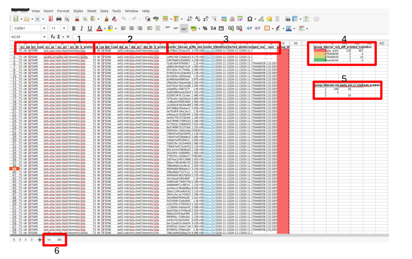

<!-- [![Contributors][contributors-shield]][contributors-url]
[![Forks][forks-shield]][forks-url]
[![Stargazers][stars-shield]][stars-url]
[![Issues][issues-shield]][issues-url]
[![MIT License][license-shield]][license-url]
[![LinkedIn][linkedin-shield]][linkedin-url]-->


<!-- PROJECT LOGO -->
<br />
<p align="center">
  <a href="https://github.com/4quarks/CMS_Grid_Support">
    
  </a>

  <h3 align="center">CMS Site Support</h3>

  <p align="center">
    Tools to accelerate monitoring in the CMS computing grid
    <br />
    <a href="https://github.com/4quarks/CMS_Grid_Support/documents"><strong>Explore the docs »</strong></a>
    <br />
    <br />
    <a href="#usage">View Demo</a>
    ·
    <a href="https://github.com/4quarks/CMS_Grid_Support/issues">Report Bug</a>
    ·
    <a href="https://github.com/4quarks/CMS_Grid_Support/milestones">Request Feature</a>
  </p>
</p>


<!-- TABLE OF CONTENTS -->
<details open="open">
  <summary>Table of Contents</summary>
  <ol>
    <li>
      <a href="#about-the-project">About The Project</a>
      <ul>
        <li><a href="#built-with">Built With</a></li>
        <li><a href="#structure">Structure</a></li>
      </ul>
    </li>
    <li>
      <a href="#getting-started">Getting Started</a>
      <ul>
        <li><a href="#prerequisites">Prerequisites</a></li>
        <li><a href="#installation">Installation</a></li>
      </ul>
    </li>
    <li><a href="#usage">Usage</a></li>
    <li><a href="#roadmap">Roadmap</a></li>
    <li><a href="#contributing">Contributing</a></li>
    <li><a href="#license">License</a></li>
    <li><a href="#acknowledgements">Acknowledgements</a></li>
  </ol>
</details>


<!-- ABOUT THE PROJECT -->
## About The Project

<!-- [![Product Name Screen Shot][product-screenshot]](https://example.com) -->
We developed a collection of scripts for developers and site admins. 
The main purpose is to reduce the monitoring time consuming and empowering utilities to assist sites.
Furthermore, collect errors information for analysis purposes. 

### Built With
The main technologies used on this project are:
* [Python 3](https://www.python.org/)
* [ElasticSearch](https://www.elastic.co/)

### Structure
```
$ tree -I 'venv|*pycache*|images|documents|*.pyc'
CMS_Grid_Support
├── LICENSE
├── README.md
├── requirements.txt
└── tools
    ├── app.py
    ├── __init__.py
    ├── __main__.py
    ├── sites
    │   ├── __init__.py
    │   ├── jobs.py
    │   ├── __main__.py
    │   ├── sam3.py
    │   ├── site_status.py
    │   └── vofeed.py
    ├── transfers
    │   ├── __init__.py
    │   ├── __main__.py
    │   ├── transfers.py
    │   └── transfers_rucio.py
    └── utils
        ├── constants.py
        ├── __init__.py
        ├── mongotools.py
        ├── nlp_utils.py
        ├── query_utils.py
        ├── site_utils.py
        └── transfers_utils.py
```

<!-- GETTING STARTED -->
## Getting Started

To get a local copy up and running follow these simple example steps.

### Prerequisites

This is an example of how to list things you need to use the software and how to install them.
* Python 3
  ```sh
  python ––version
  sudo apt install python3
  ```
* Grafana key to query ElasticSearch. e.g. "Bearer FNJZ0gyS..." 

### Installation

1. Clone the repo:
   ```
   $ git clone git@github.com:paucutrina/CMS_Grid_Support.git
   ```
2. Setup virtual environment:
    ```
    $ cd CMS_Grid_Support
    $ sudo apt-get install python3-venv
    $ python3 -m venv venv
    $ source venv/bin/activate
    ```
3. Install Python libraries listed on the `requirements.txt`:
   ```
   $ pip install -r requirements.txt
   ```
4. Add environmental variables:
    ```
    $ export GRAFANA_KEY="Bearer FNJZ0gyS..."
    ```

<!-- USAGE EXAMPLES -->
## Usage
You can see the functionalities:
```
$ python -m tools -h
```

### Transfers
Running the `transfers` module you will write an Excel with all the transfers errors for a 
certain period (--hours/--days/--minutes, default 24h) for one specific site/host. You can filter the search blacklisting 
sites, endpoints, directories, etc from the url (--blacklist) or looking for an specific error (--error).
You can also write a txt file with all the LFNs grouped by error (--write_lfns). 

```
$ python -m tools transfers -h
```
Here below you can see different examples:
```
$ python -m tools transfers storm.ifca.es
$ python -m tools transfers T1_UK_RAL 
$ python -m tools transfers T1_UK_RAL --hours 16
$ python -m tools transfers T1_UK_RAL --blacklist "se3.itep.ru/temp/Checksum"
$ python -m tools transfers T1_UK_RAL --error No.such.file
$ python -m tools transfers T1_UK_RAL --write_lfns 
```
<p align="center">
 
</p>

1. Source information
2. Destination information
3. File details
4. Number of failures grouped by error type
5. Failures grouped by sites
6. Direction of the transfers from the specified target point of view. 

\* If there are user errors it automatically creates a table with the usernames. 

### Site Status
Running the `sites` module you will write an Excel file with the SAM errors of 
the target computing resource or site for a certain period (--hours/--days/--minutes, default 5h).
You can specify the flavour (--flavour) as well as the blacklisted sites and hosts (--blacklist). 

```
$ python -m tools sites -h
```
Here below you can see different examples:
```
$ python -m tools status T1_UK_RAL
$ python -m tools status "T1|T2"
$ python -m tools status T1_UK_RAL --flavour CE
$ python -m tools status T1_UK_RAL --hours 8
$ python -m tools status T1_UK_RAL --blacklist T2_PL_Warsaw
```


<!-- ROADMAP -->
## Roadmap

See the [milestones](https://github.com/4quarks/CMS_Grid_Support/milestones) for a list of proposed features.
You can also see the known [issues](https://github.com/4quarks/CMS_Grid_Support/issues). 
If you have suggestions, please, do not hesitate to create new milestones and report issues! 

#### Intelligent Sites Analysis
This is still under development but the idea is to implement an intelligent system to detect, classify and report 
site errors. 

<!-- 
- Install mongodb e.g. Ubuntu:
```
wget -qO - https://www.mongodb.org/static/pgp/server-4.4.asc | sudo apt-key add -
echo "deb [ arch=amd64,arm64 ] https://repo.mongodb.org/apt/ubuntu focal/mongodb-org/4.4 multiverse" | sudo tee /etc/apt/sources.list.d/mongodb-org-4.4.list
sudo apt-get update
sudo apt-get install -y mongodb-org
echo "mongodb-org hold" | sudo dpkg --set-selections
echo "mongodb-org-server hold" | sudo dpkg --set-selections
echo "mongodb-org-shell hold" | sudo dpkg --set-selections
echo "mongodb-org-mongos hold" | sudo dpkg --set-selections
echo "mongodb-org-tools hold" | sudo dpkg --set-selections
sudo systemctl start mongod
sudo systemctl status mongod
mongo
export MONGODB_HOST="localhost:27017"
```
- Download NLP model:
```
python -m spacy download en_core_web_lg
```
-->

<!-- CONTRIBUTING -->
## Contributing

Contributions are what make the open source community such an amazing place to be learn, inspire, and create. Any contributions you make are **greatly appreciated**.

1. Fork the Project
2. Create your Feature Branch (`git checkout -b feature/AmazingFeature`)
3. Commit your Changes (`git commit -m 'Add some AmazingFeature'`)
4. Push to the Branch (`git push origin feature/AmazingFeature`)
5. Open a Pull Request


<!-- LICENSE -->
## License

Distributed under the MIT License. See `LICENSE` for more information.

<!-- ACKNOWLEDGEMENTS -->
## Acknowledgements
* [FTSmon](https://fts3.cern.ch:8449/fts3/ftsmon/#/)
* [MonIT Kibana](https://monit-kibana.cern.ch)


<!-- MARKDOWN LINKS & IMAGES -->
<!-- https://www.markdownguide.org/basic-syntax/#reference-style-links -->
<!-- [contributors-url]: https://github.com/4quarks/CMS_Grid_Support/graphs/contributors
[contributors-shield]: https://img.shields.io/github/contributors/othneildrew/Best-README-Template.svg?style=for-the-badge
[forks-shield]: https://img.shields.io/github/forks/othneildrew/Best-README-Template.svg?style=for-the-badge
[forks-url]: https://github.com/othneildrew/Best-README-Template/network/members
[stars-shield]: https://img.shields.io/github/stars/othneildrew/Best-README-Template.svg?style=for-the-badge
[stars-url]: https://github.com/othneildrew/Best-README-Template/stargazers
[issues-shield]: https://img.shields.io/github/issues/othneildrew/Best-README-Template.svg?style=for-the-badge
[issues-url]: https://github.com/othneildrew/Best-README-Template/issues
[license-shield]: https://img.shields.io/github/license/othneildrew/Best-README-Template.svg?style=for-the-badge
[license-url]: https://github.com/othneildrew/Best-README-Template/blob/master/LICENSE.txt
[linkedin-shield]: https://img.shields.io/badge/-LinkedIn-black.svg?style=for-the-badge&logo=linkedin&colorB=555
[linkedin-url]: https://linkedin.com/in/othneildrew
[product-screenshot]: images/screenshot.png -->
